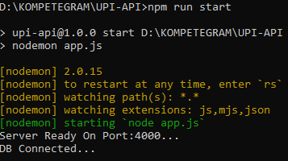
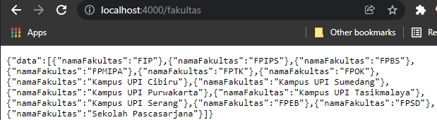

# **API Fakultas Prodi dengan Express JS - MongoDB**

## **Tata Cara Menjalankan**
### Clone repository ini
```bash
git clone https://github.com/Gre-ys/UPI-API
```
###  Install Seluruh Package/dependensi yang dibutuhkan(tertera di package.json)
```bash
npm install
```
### Buat file .env di dalam local repository lalu di dalamnya buat variabel untuk link koneksi database
```bash
MONGODB_URI = link koneksi database mongodb
```
### Buka terminal lalu masuk ke local repository serta jalankan perintah untuk memulai server
```bash
npm run start
```
### Tunggu sampai di dalam terminal tertera pemberitahuan

### Untuk cek penggunaan API, akses localhost:4000/end-point di browser atau di aplikasi pengujian API seperti Postman

